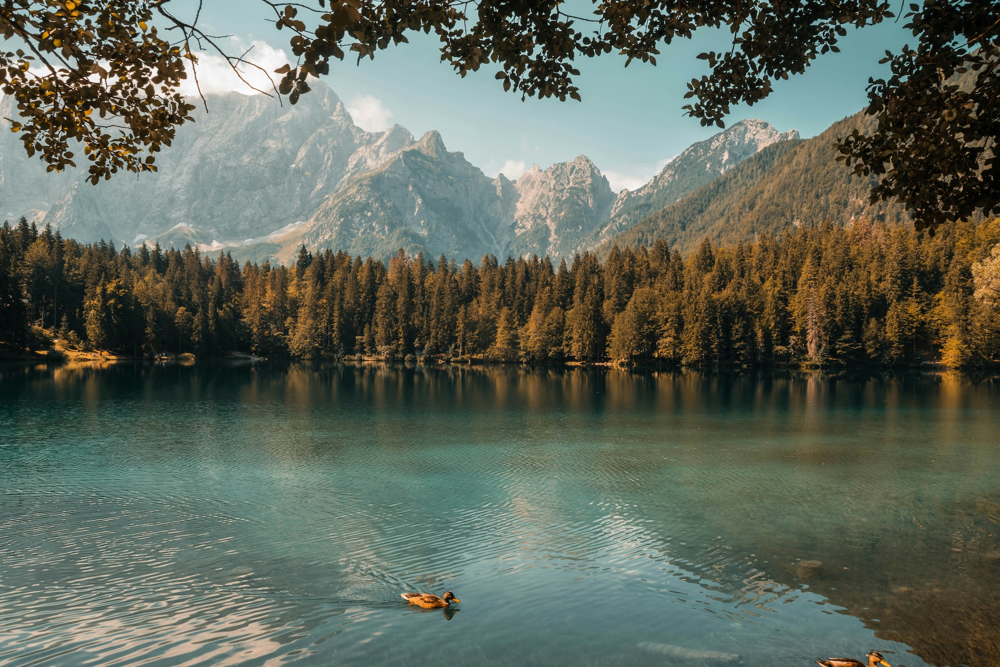
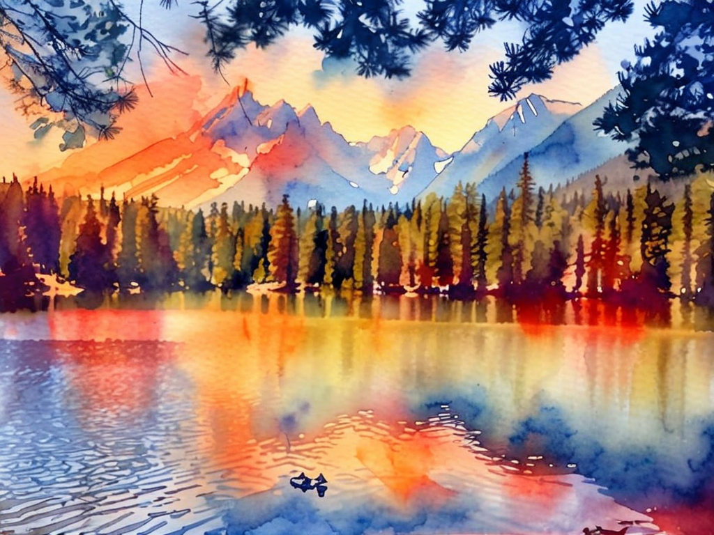

# Image Style Transfer

Transform photographs into artistic styles using natural language prompts.

### Image Prompt Template
    Transform this {photograph} into {description of output type}: {Description of objects}. It should have {description of style}

    
## Example
### Amazon Nova Canvas Condition Image


### Amazon Nova Canvas Image Prompt Text
    Transform this photograph into an artistic watercolor painting: A serene mountain lake at sunset, with tall pine trees reflecting in the still water. It should have soft flowing pigments with visible paper texture throughout, brush strokes on the water, delicate color bleeds and gradients, traditional watercolor technique with natural light and shadow transitions, controlled wet-on-wet effects, preserved highlights, professional art style, masterful brush strokes, vibrant yet realistic color palette, slight pigment granulation, subtle paper showing through thin washes, Andrew Wyeth meets William Turner quality, 8k resolution, artstation trending

### Amazon Nova Canvas Image Prompt Negative Text
    sharp edges, photorealistic, digital art style

### Amazon Nova Canvas Image Generation Settings
    controlMode: CANNY_EDGE
    controlStrength: .7
    numberOfImages: 1,
    quality: "premium"
    width: 1024
    height: 768
    cfgScale: 8.0
    seed: 42

### Amazon Nova Canvas Sample Response


### API Request
=== "python"

    ```python
    --8<-- "docs/prompts/generation/image_manipulation/example.py"
    ```

=== "AWS CLI"

    ```bash
    --8<-- "docs/prompts/generation/image_manipulation/example.sh"
    ```

=== "json"

    ```json
    --8<-- "docs/prompts/generation/image_manipulation/example.json"
    ```